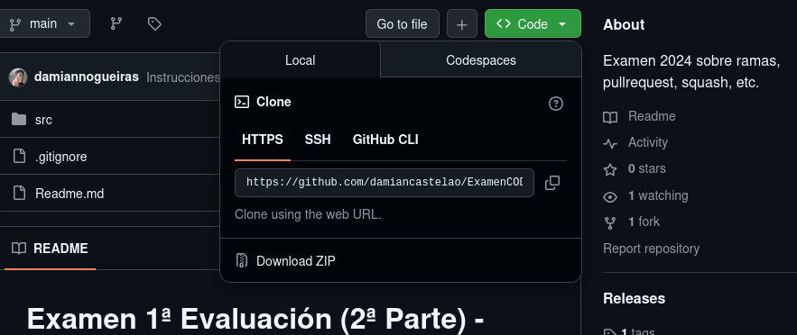
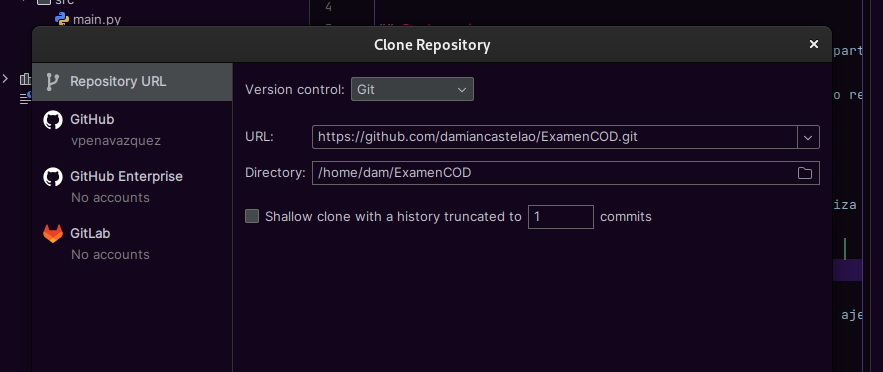
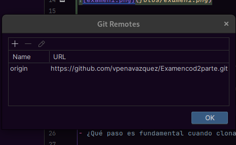
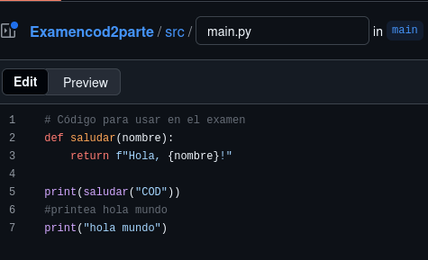
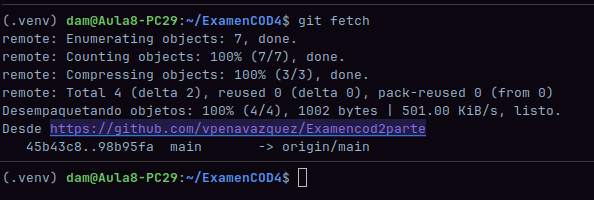
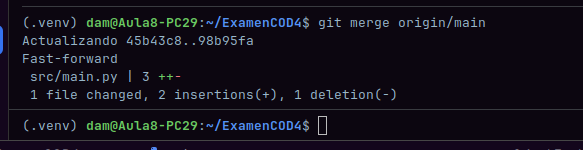

# Examen 1ª Evaluación (2ª Parte) - Control de Versiones
 - Victor Pena Vazquez
---

## Instrucciones
- Los commits de cada apartado deben tener el mensaje *"Apartado X - descripción del cambio realizado"*
- Entrega en la tarea de Moodle tu repositorio
- Solo se corrigen los commits que estén en el repositorio remoto

### Apartado 1

- Clona este repositorio.
- Modifica este Readme, poniendo tu nombre completo, realiza un `commit` con el mensaje *"Apartado 1"* y un `push`.

- copiamos esa url 

- la pegamos en file - project from version control

- creamos un nuevo repositorio en github 

- y pegamos la url del repositorio que hayamos creado en git- manage remotes
Pregunta 

- ¿Qué paso es fundamental cuando clonamos un repositorio ajeno para que podamos subir nuestros propios commits? Explícalo y utiliza capturas de pantalla.
- Es fundamental que peguemos en git - manage remotes nuestro repositorio creado manualmente, porque si clonas el repositorio de alguien y quieres hacer push sin cambiar manage remotes, te dara error porque no tienes autorizacion
### Apartado 2

- Realiza una modificación en el código en la web de tu repositorio en GitHub
- Utiliza fetch para descargar los cambios realizados en tu repositorio.

- modificacion del codigo en la web

-git fetch y git merge origin/main hecho

Pregunta
- Explica los pasos para que el código modificado en GitHub, llegue a tu rama principal local. Explícalo con capturas de pantalla.

- El comando git fetch solamente descarga los metadatos y los commits del repositorio remoto a mi carpeta oculta .git, actualizando la referencia remota (origin/main). Sin embargo, no toca mi directorio de trabajo ni mi rama local (main). Para que el código aparezca en mi archivo local, es necesario realizar un MERGE (Fusión) de la rama remota hacia mi rama local.
### Apartado 3

- Realiza otro cambio desde la web de tu repositorio en GitHub.
- Utiliza pull para descargar los cambios realizados en tu repositorio.

Pregunta
- Explica los pasos dados para que el cambio realizado en GitHub, llegue a tu rama principal local. Explícalo con capturas de pantalla.

